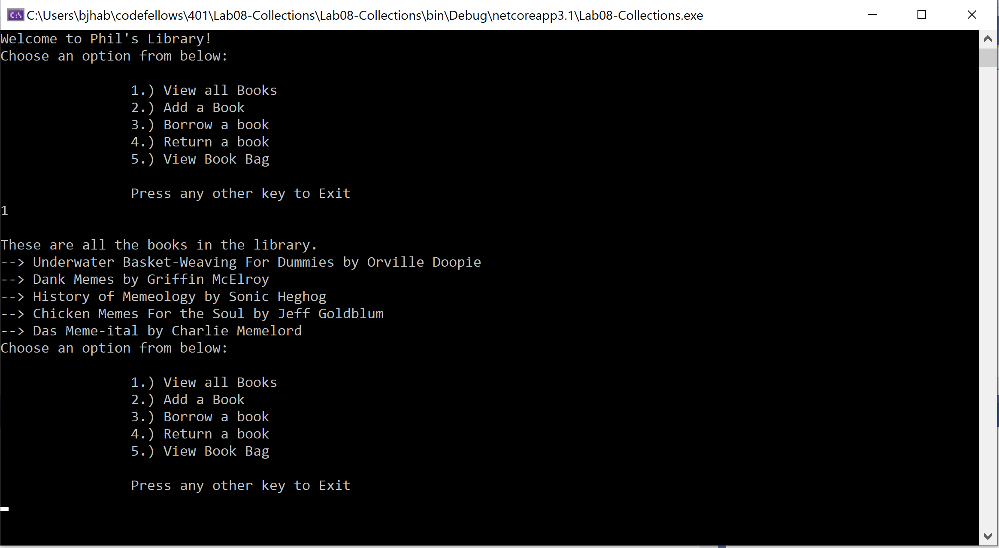

# Lab08-Collections
Code Fellows 401: Lab 08.

## Introduction

Lab08 - Collections

Authors: Bade Habib, Lami Beach

----

## Description
This is a C# console application to practically apply concepts of interfaces and collection classes. This is done by simulating an interaction with a library where the user borrows books, adds new books, and removes books from the library.

---

### Getting Started
Clone this repository to your local machine.

```
$ git clone [x]
```

### To run the program from Visual Studio:
Select ```File``` -> ```Open``` -> ```Project/Solution```

Next navigate to the location you cloned the Repository.

Double click on the ```Lab08-Collections``` directory.

Then select and open ```Lab08-Collections.sln```

---
### Visuals
#### Example: Viewing All Books in Library


---
### Change Log
- Initial commit
- Added ViewAllBooks() and ViewBookBag(). Implemented UserInterface() options.
